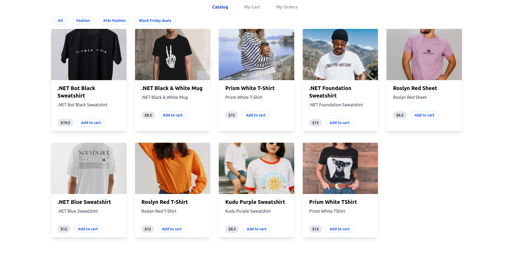
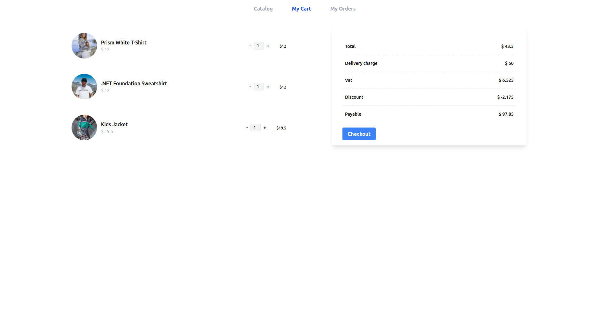
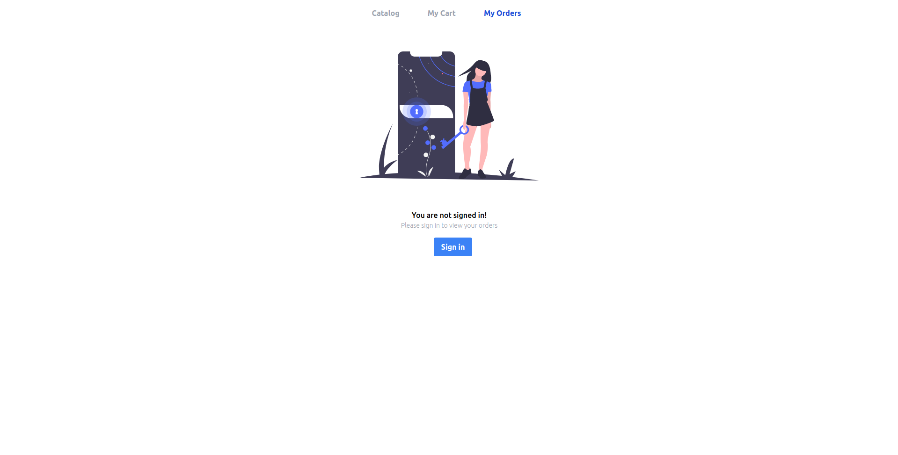
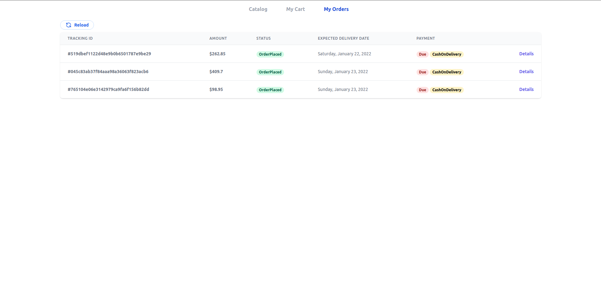

# Simple Cart

> A sample application that demonstrates how to wire up a nuxt js based front end SPA powered by an .NET 6 on the backend with Azure AD authentication.

Te application it self is a simple shopping cart
With functionalities like, 
1. View products
2. Add product to cart
3. Manage cart
4. Authentication using Microsoft
5. View Orders

